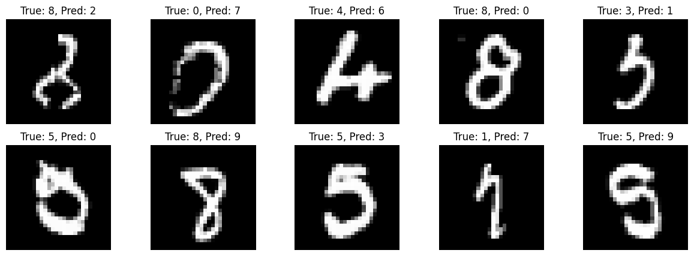

# Technical Note: Vision Transformer Model on the MNIST Dataset

## Project Overview

I trained this model which implements a Vision Transformer (ViT) model to classify handwritten digits from the MNIST dataset, a well-known benchmark in machine learning consisting of 70,000 (60,000 training and 10,000 testing) images of handwritten digits (0-9), each sized 28x28 pixels. Also I only trained the model for only 10 epochs and it took 20 minutes to train so it can be improved with more epochs like 30 to get even better results. (For this training I got 97.77% accuracy on the test dataset.)

## Objectives
- Explore the effectiveness of transformer architectures in image classification tasks.
- Achieve high accuracy on the MNIST dataset using a ViT model.

## Dataset
- **Source**: The MNIST dataset can be downloaded from [Yann LeCun's website](http://yann.lecun.com/exdb/mnist/).
- **Composition**: 60,000 training images and 10,000 testing images.
- **Image Format**: Grayscale images of size 28x28 pixels.

## Model Architecture
The model utilizes the Vision Transformer architecture, which includes:
- **Patch-based Attention Mechanism**: Input images are divided into patches and linearly embedded into a sequence of tokens.
- **Multi-head Self-attention Layers**: Allow the model to focus on different parts of the image simultaneously.
- **Feed-forward Neural Networks**: Each token is processed through a feed-forward network after the attention mechanism.

### Configuration
- **Image Size**: 28x28
- **Patch Size**: 7x7
- **Number of Classes**: 10 (digits 0-9)
- **Hidden Size**: 128
- **Number of Hidden Layers**: 4
- **Number of Attention Heads**: 4
- **Input Channels**: 1 (for grayscale images)

## Training
- **Loss Function**: Cross-Entropy Loss
- **Optimizer**: Adam
- **Learning Rate**: 3e-4
- **Batch Size**: 64
- **Number of Epochs**: 10

### Training Process
1. **Data Augmentation**: Random rotations and horizontal flips were applied to enhance the training dataset.
2. **Model Training**: The model was trained on the training dataset, and the loss was monitored over epochs.

## Results
- **Test Accuracy**: The model achieved a test accuracy of **97.77%** on the MNIST dataset.
- **Performance Metrics**: A classification report was generated, providing insights into precision, recall, and F1-score for each digit class.

### Confusion Matrix

### Misclassifications

## Conclusion
The Vision Transformer model demonstrated strong performance on the MNIST dataset, achieving a high accuracy of 97.77%. This project illustrates the potential of transformer architectures in image classification tasks, paving the way for further exploration in more complex datasets and tasks.

## Future Work
- **Hyperparameter Tuning**: Further tuning of hyperparameters to improve model performance.
- **Data Augmentation**: Experimenting with additional data augmentation techniques.
- **Transfer Learning**: Fine-tuning pretrained models on the MNIST dataset.
- **Deployment**: Creating a web application for real-time digit recognition.

## Repository
The complete code and documentation for this project can be found at: [GitHub Repository](https://github.com/chama-x/ViT-model-on-the-MNIST-dataset)
